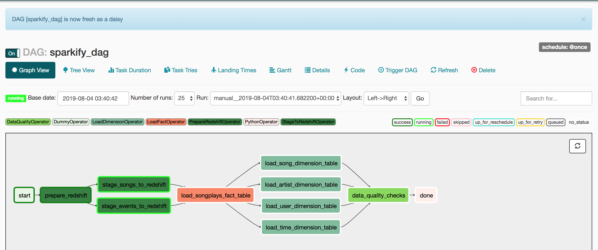

# Data Engineering Pipeline with Apache Airflow

The music streaming company Spakify wishes to introduce automation to their
data pipelines and has selected the Apache Airflow product as their automation
solution. The goal is to convert an existing ETL process that reads records
from an S3 bucket, creates staging tables in AWS Redshift and then builds a fact
and dimension tables for the analytics team.

As part of the automation a data quality check will be introduced at the end
of the data pipeline.

This project creates docker containers for Apache Airflow and PostgreSQL to have
a reliable build and deploy process when this project is moved into production.

## Project Set Up

### Local Docker Containers

Run the following scripts to build the two images for this project:

    bin/build_postgres.sh

    bin/build_airflow.sh

See the `Containerizing and Using Airflow` section below for referenced material.

### AWS Redshift Cluster

Follow the normal Redshift cluster creation documentation available on AWS with the addition
of using an `Elastic IP` for the publicly exposed IP address. The `Elastic IP` helps with
diagnosing configuration problems.

The steps for create a new Redshift cluster are generally:

1. Click "Launch cluster"
2. Enter unique cluster identifier and "sparkify" for database name and master username
3. Enter and confirm master username password
4. Click "Continue"
5. Select node type and create 2 node multi-node cluster
6. Click "Continue"
7. Select default VPC and default subnet group
8. Select "Choose a public IP address" and select an existing Elastic IP
9. Click "Continue"
10. Review settings and click "Launch cluster"

Ensure that port 5439 is open on the VPC Security Group that is assigned
to the cluster. With this configuration the Redshift cluster may accessed using a
normal desktop database client (like DbVisualizer).

## Testing Airflow Operators

Several Airflow operators have been created to support the orchestration of tasks for
this project. These operators re-use boto3 code to read S3 bucket records from a previous
project and the `PostgresHook` to insert and select records from AWS Redshift.

Creating and maintaining Airflow operators may be done from the command-line using
the `airflow` command the `test` argument. This test feature executes the task
outside of the normal DAG dependency structure.

    airflow test sparkify_dag prepare_redshift 2019-08-03;

    airflow test sparkify_dag stage_events_to_redshift 2019-08-03;

    airflow test sparkify_dag stage_songs_to_redshift 2019-08-03;

    airflow test sparkify_dag load_songplays_fact_table 2019-08-03;

    airflow test sparkify_dag load_user_dimension_table 2019-08-03;

    airflow test sparkify_dag load_time_dimension_table 2019-08-03;

    airflow test sparkify_dag data_quality_checks 2019-08-03;

## Running the Sparkify DAG

Start the two containers in the project with `bin/start_postgres.sh` and `bin/start_airflow.sh`.

Open a web browser to `localhost:8080` to access the Apache Airflow UI.

First, ensure that the Airflow DAGs page show no errors for the `sparkify_dag`. Then, click
on the `sparkify_dag` link to open the DAG. Click `Trigger DAG` to start the DAG.

The DAG will appear as shown below. Loading song data takes a long time -- be patient.

The data quality check task returns the following record counts.

|songplays_count  |artists_count  |songs_count  |times_count  |users_count  |
|-----------------|---------------|-------------|-------------|-------------|
|6820             |10025          |14896        |6820         |104          |

The screen capture of the data quality check task.

## Extra: Containerizing and Using Airflow

https://airflow.apache.org/start.html

https://medium.com/@shahnewazk/dockerizing-airflow-58a8888bd72d

https://medium.com/datareply/airflow-lesser-known-tips-tricks-and-best-practises-cf4d4a90f8f

## Extra: Copy Project's Workspace

    zip -r workspace.zip workspace
    mv workspace.zip workspace_original.zip
    mv workspace_original.zip workspace
